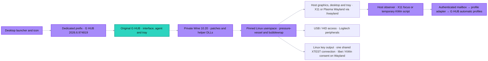

# 1 · System overview

```mermaid
%%{init: {"theme":"default","themeVariables":{"background":"transparent","fontSize":"18px","lineColor":"#9399b2","edgeLabelBackground":"#e8e8e8"},"themeCSS":".edgeLabel rect{opacity:1}","flowchart":{"htmlLabels":false,"useMaxWidth":false,"curve":"basis","padding":12,"nodeSpacing":45,"rankSpacing":55,"wrappingWidth":300}}}%%
flowchart LR
    A["Desktop launcher and icon"] --> B["Dedicated prefix · G HUB 2026.6.974819"]
    B --> C["Original G HUB · interface, agent and tray"]
    C --> D["Private Wine 10.20 · patches and helper DLLs"]
    D --> E["Pinned Linux userspace · pressure-vessel and bubblewrap"]
    E --> F["Host graphics, desktop and tray · X11 or Plasma Wayland via Xwayland"]
    E --> G["USB / HID access · Logitech peripherals"]
    E --> H["Linux key output · one shared XTEST connection · libei / KWin consent on Wayland"]
    F --> I["Host observer · X11 focus or temporary KWin script"]
    I --> J["Authenticated mailbox → profile adapter → G HUB automatic profiles"]
    class I,J c1
    class A,B,D,E c1
    class C c2
    classDef c1 fill:#a78bfa,stroke:#7c3aed,color:#111,stroke-width:2px
    classDef c2 fill:#2dd4bf,stroke:#0d9488,color:#111,stroke-width:2px
```
