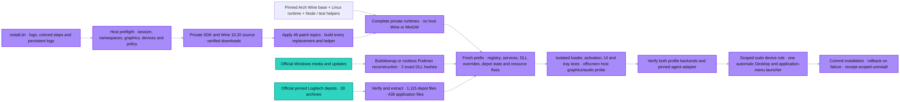

# 2 · Complete installer pipeline

```mermaid
%%{init: {"theme":"default","themeVariables":{"background":"transparent","fontSize":"18px","lineColor":"#9399b2","edgeLabelBackground":"#e8e8e8"},"themeCSS":".edgeLabel rect{opacity:1}","flowchart":{"htmlLabels":false,"useMaxWidth":false,"curve":"basis","padding":12,"nodeSpacing":45,"rankSpacing":55,"wrappingWidth":300}}}%%
flowchart LR
    A["install.sh · logo, colored steps and persistent logs"] --> B["Host preflight · session, namespaces, graphics, devices and policy"]
    B --> C["Private SDK and Wine 10.20 source · verified downloads"]
    C --> D["Apply 46 patch topics · build every replacement and helper"]
    E["Pinned Arch Wine base + Linux runtime + Node / test helpers"] --> F["Complete private runtimes · no host Wine or MinGW"]
    D --> F
    G["Official Windows media and updates"] --> H["Bubblewrap or rootless Podman reconstruction · 2 exact DLL hashes"]
    I["Official pinned Logitech depots · 30 archives"] --> J["Verify and extract · 1,115 depot files · 438 application files"]
    F --> K["Fresh prefix · registry, services, DLL overrides, depot state and resource fixes"]
    H --> K
    J --> K
    K --> L["Isolated loader, activation, UI and tray tests · offscreen host graphics/audio probe"]
    L --> P["Verify both profile backends and pinned agent adapter"] --> M["Scoped sudo device rule · one automatic Desktop and application-menu launcher"]
    M --> N["Commit installation · rollback on failure · receipt-scoped uninstall"]
    class P,N c1
    class A,B,C,D,F,H,J,K,L,M c1
    class G,I c2
    classDef c1 fill:#a78bfa,stroke:#7c3aed,color:#111,stroke-width:2px
    classDef c2 fill:#2dd4bf,stroke:#0d9488,color:#111,stroke-width:2px
```
