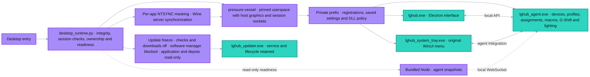

# 3 · Desktop launch and application

```mermaid
%%{init: {"theme":"default","themeVariables":{"background":"transparent","fontSize":"18px","lineColor":"#9399b2","edgeLabelBackground":"#e8e8e8"},"themeCSS":".edgeLabel rect{opacity:1}","flowchart":{"htmlLabels":false,"useMaxWidth":false,"curve":"basis","padding":12,"nodeSpacing":45,"rankSpacing":55,"wrappingWidth":300}}}%%
flowchart LR
    A["Desktop entry"] --> B["desktop_runtime.py · integrity, session checks, ownership and readiness"]
    B --> C["pressure-vessel · pinned userspace with host graphics and session sockets"]
    C --> D["Private prefix · registrations, saved settings and DLL policy"]
    D --> E["lghub_agent.exe · devices, profiles, assignments, macros, G-Shift and lighting"]
    D --> F["lghub.exe · Electron interface"]
    D --> G["lghub_system_tray.exe · original WinUI menu"]
    F <-- "local API" --> E
    G <-- "agent integration" --> E
    B --> H["Update freeze · checks and downloads off · software manager blocked · application and depots read-only"]
    H --> I["lghub_updater.exe · service and lifecycle retained"]
    B --> J["Per-app NTSYNC masking · Wine server synchronization"]
    J --> C
    B -. "read-only readiness" .-> K["Bundled Node · agent snapshots"]
    K -. "local WebSocket" .-> E
    class A,B,C,D,H,J,K c1
    class E,F,G,I c2
    classDef c1 fill:#a78bfa,stroke:#7c3aed,color:#111,stroke-width:2px
    classDef c2 fill:#2dd4bf,stroke:#0d9488,color:#111,stroke-width:2px
```
