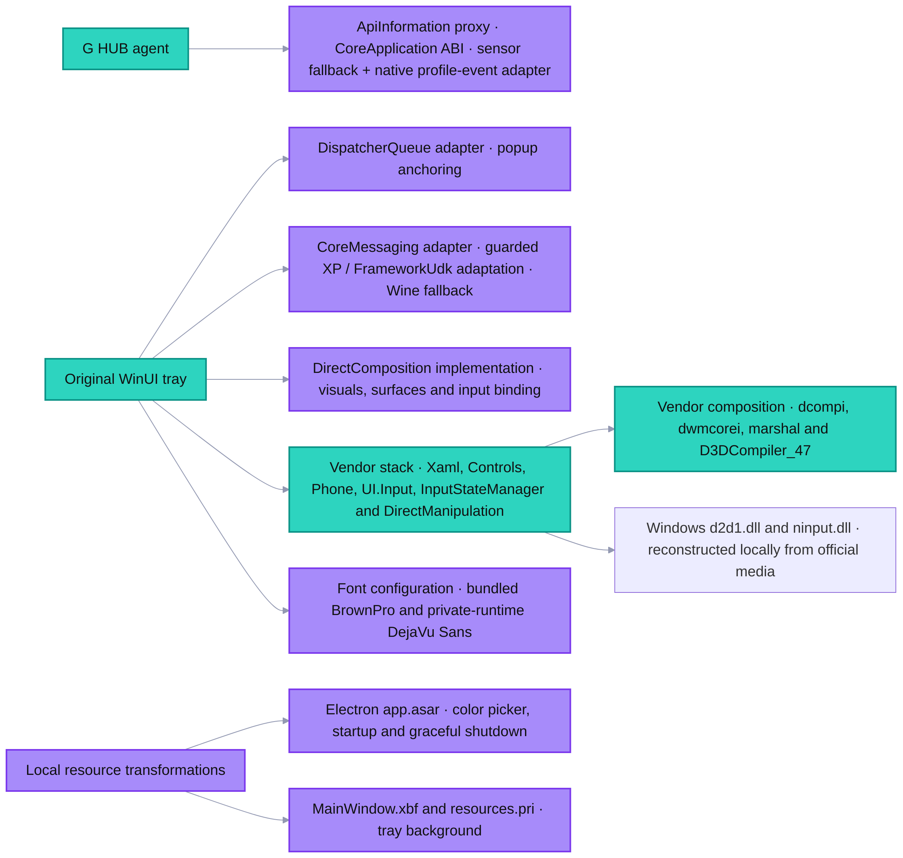

# 4 · Supplementary components and resources

```mermaid
%%{init: {"theme":"default","themeVariables":{"background":"transparent","fontSize":"18px","lineColor":"#9399b2","edgeLabelBackground":"#e8e8e8"},"themeCSS":".edgeLabel rect{opacity:1}","flowchart":{"htmlLabels":false,"useMaxWidth":false,"curve":"basis","padding":12,"nodeSpacing":45,"rankSpacing":55,"wrappingWidth":300}}}%%
flowchart LR
    A["G HUB agent"] --> B["ApiInformation proxy · CoreApplication ABI · sensor fallback + native profile-event adapter"]
    C["Original WinUI tray"] --> D["DispatcherQueue adapter · popup anchoring"]
    C --> E["CoreMessaging adapter · guarded XP / FrameworkUdk adaptation · Wine fallback"]
    C --> F["DirectComposition implementation · visuals, surfaces and input binding"]
    C --> G["Vendor stack · Xaml, Controls, Phone, UI.Input, InputStateManager and DirectManipulation"]
    G --> H["Vendor composition · dcompi, dwmcorei, marshal and D3DCompiler_47"]
    G --> I["Windows d2d1.dll and ninput.dll · reconstructed locally from official media"]
    J["Local resource transformations"] --> K["Electron app.asar · color picker, startup and graceful shutdown"]
    J --> L["MainWindow.xbf and resources.pri · tray background"]
    C --> M["Font configuration · bundled BrownPro and private-runtime DejaVu Sans"]
    class B,D,E,F,J,K,L,M c1
    class A,C,G,H c2
    classDef c1 fill:#a78bfa,stroke:#7c3aed,color:#111,stroke-width:2px
    classDef c2 fill:#2dd4bf,stroke:#0d9488,color:#111,stroke-width:2px
```
