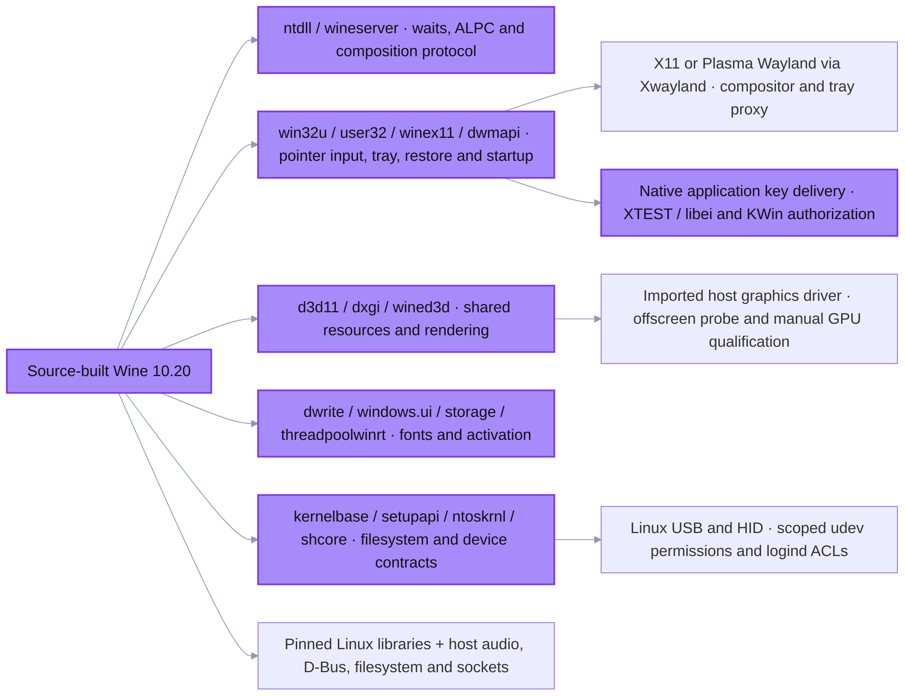

# 5 · Wine changes and Linux integration

```mermaid
%%{init: {"theme":"default","themeVariables":{"background":"transparent","fontSize":"18px","lineColor":"#9399b2","edgeLabelBackground":"#e8e8e8"},"themeCSS":".edgeLabel rect{opacity:1}","flowchart":{"htmlLabels":false,"useMaxWidth":false,"curve":"basis","padding":12,"nodeSpacing":45,"rankSpacing":55,"wrappingWidth":300}}}%%
flowchart LR
    A["Source-built Wine 10.20"] --> B["ntdll / wineserver · waits, ALPC and composition protocol"]
    A --> C["win32u / user32 / winex11 / dwmapi · pointer input, tray, restore and startup"]
    A --> D["d3d11 / dxgi / wined3d · shared resources and rendering"]
    A --> E["dwrite / windows.ui / storage / threadpoolwinrt · fonts and activation"]
    A --> F["kernelbase / setupapi / ntoskrnl / shcore · filesystem and device contracts"]
    C --> G["X11 or Plasma Wayland via Xwayland · compositor and tray proxy"]
    C --> H["Native application key delivery · XTEST / libei and KWin authorization"]
    D --> I["Imported host graphics driver · offscreen probe and manual GPU qualification"]
    F --> J["Linux USB and HID · scoped udev permissions and logind ACLs"]
    A --> K["Pinned Linux libraries + host audio, D-Bus, filesystem and sockets"]
    class A,B,C,D,E,F,H c1
    classDef c1 fill:#a78bfa,stroke:#7c3aed,color:#111,stroke-width:2px
    classDef c2 fill:#2dd4bf,stroke:#0d9488,color:#111,stroke-width:2px
```
