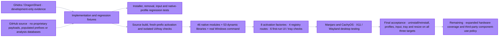

# 6 · Validation and release boundary

```mermaid
%%{init: {"theme":"default","themeVariables":{"background":"transparent","fontSize":"18px","lineColor":"#9399b2","edgeLabelBackground":"#e8e8e8"},"themeCSS":".edgeLabel rect{opacity:1}","flowchart":{"htmlLabels":false,"useMaxWidth":false,"curve":"basis","padding":12,"nodeSpacing":45,"rankSpacing":55,"wrappingWidth":300}}}%%
flowchart LR
    A["Ghidra / DragonShard · development-only evidence"] --> B["Implementation and regression fixtures"]
    B --> C["Installer, removal, input and native-profile regression tests"]
    B --> D["Source build, fresh-prefix activation and isolated UI/tray checks"]
    D --> E["46 native modules + 53 dynamic libraries + real Windows command"]
    E --> F["8 activation factories · 4 registry routes · 6 first-run UI / tray checks"]
    F --> G["Manjaro and CachyOS · X11 / Wayland desktop testing"]
    G --> H["Final acceptance · uninstall/reinstall, profiles, input, tray and resize on all three targets"]
    I["GitHub source · no proprietary payloads, populated prefixes or analysis databases"] --> B
    H --> J["Remaining · expanded hardware coverage and third-party component-use policy"]
    class A,B,C,D,E,F,G,H,I,J c1
    classDef c1 fill:#a78bfa,stroke:#7c3aed,color:#111,stroke-width:2px
    classDef c2 fill:#2dd4bf,stroke:#0d9488,color:#111,stroke-width:2px
```
